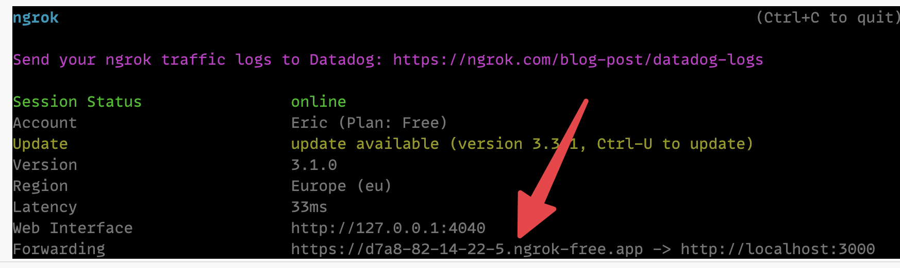

## Deploy to Fly

You can use this repository as a jumping off point for deploying a self-hosted version of [Trigger.dev](https://trigger.dev) on Fly.io using the Trigger.dev public docker image located at `ghcr.io/triggerdotdev/trigger.dev:latest`

### Fork this repository and change the app name

You should fork this repository before starting so you can make changes and commit them. For example, you'll need to change the `app` property in the `fly.toml` file to be something other than `app = "trigger-v2-fly-demo"`.

### Install and configure the fly.io CLI

Install the Fly CLI tool:

```sh
brew install flyctl
```

Authenticate the CLI:

```sh
fly auth login
```

### Create the fly.io app and pg db

Launch the app:

```sh
fly launch
```

Follow the prompts by `fly launch` and make sure to answer them in the following way:

```sh
? Would you like to copy its configuration to the new app? Yes
? Choose an app name (leaving blank will default to 'trigger-v2-fly-demo') <enter your preferred app name here or leave blank>
? Would you like to set up a Postgresql database now? Yes
? Select configuration: Development - Single node, 1x shared CPU, 256MB RAM, 1GB disk <- feel free to pick a beefier machine
? Would you like to set up an Upstash Redis database now? No
? Would you like to deploy now? No
```

### Gather your secret environment variables

#### AUTH_GITHUB_CLIENT_ID and AUTH_GITHUB_CLIENT_SECRET (optional)

If you plan on logging in with GitHub auth, you'll need to create a GitHub OAuth app with the following configuration:


Once you register the application you'll need to click on the "Generate new client secret" button:


And then you can copy out the AUTH_GITHUB_CLIENT_ID and AUTH_GITHUB_CLIENT_SECRET:


#### RESEND_API_KEY and FROM_EMAIL, REPLY_TO_EMAIL (required)

We use [Resend.com](https://resend.com) for email sending (including the magic-link signup/login system). They have a generous free tier of 100 emails a day that should be sufficient. Signup for Resend.com and enter the required environment vars below

#### MAGIC_LINK_SECRET and SESSION_SECRET (required)

Both of these secrets should be generated random strings, which you can easily generate (and copy into your pasteboard) with the following command:

```sh
openssl rand -hex 16 | pbcopy
```

#### LOGIN_ORIGIN and APP_ORIGIN (required)

Both of these secrets should be set to the base URL of your fly application. For example `https://trigger-v2-fly-demo.fly.dev`

### Set the secrets

Call the `fly secrets set` command to stage the secrets to be used on first deploy:

```sh
fly secrets set \
  MAGIC_LINK_SECRET=<random string> \
  SESSION_SECRET=<random string> \
  LOGIN_ORIGIN="https://<fly app name>.fly.dev" \
  APP_ORIGIN="https://<fly app name>.fly.dev" \
  FROM_EMAIL="Acme Inc. <hello@yourdomain.com>" \
  REPLY_TO_EMAIL="Acme Inc. <reply@yourdomain.com>" \
  RESEND_API_KEY=<your API Key> \
  AUTH_GITHUB_CLIENT_ID=<your GitHub OAuth Client ID> \
  AUTH_GITHUB_CLIENT_SECRET=<your GitHUb OAuth Client Secret>

Secrets are staged for the first deployment
```

### Deploy

Now you can deploy to fly. Here we are setting the machine VM size to use 1 dedicated CPU core with 2 GB of memory, but you can run `fly platform vm-sizes` to see other options. The below app will cost about $30/month.

```sh
fly deploy --vm-size performance-1x
```

### Visit and create an account

Once deployed, you should be able to open `https://<your fly app name>.fly.dev/` in your browser and create an account, either using GitHub or a magic email link.

### Initialize your Next.js project

Next you can easily bootstrap your Next.js project to use your self-hosted instance of Trigger.dev.

First, `cd` into your Next.js project and start the dev server using `npm run dev`, which should run the server at `localhost:3000`.

Next, you'll need to use a reverse tunneling service to expose your local Next.js dev server to the internet, to allow your self-hosted Trigger.dev instance on Fly.io to be able to make HTTP requests to your local machine. We recommend using [ngrok](https://ngrok.com/):

1. Install ngrok:

```sh
brew install ngrok/ngrok/ngrok
```

2. Create an http tunnel at port 3000:

```sh
ngrok http 3000
```

3. Grab your forwarding address in the ngrok output:



4. Run the `@trigger.dev/init` CLI to initialize your Next.js project:

Open yet another terminal window and `cd` back into your Next.js project, and then run the `@trigger.dev/init` CLI tool using `npx` (if you are using pnpm, use `pnpm dlx @trigger.dev/init`, and with yarn you can just use `yarn @trigger.dev/init`)

```sh
npx @trigger.dev/init --trigger-url "https://<your fly app name>.fly.dev" --endpoint-url "https://<subdomain>.ngrok-free.app"
```

When it asks for your development API key, head over to your self-hosted Trigger.dev dashboard and select the initial project you created when signing up, and head to the `Environments & API Keys` page to copy your `dev` API key:


